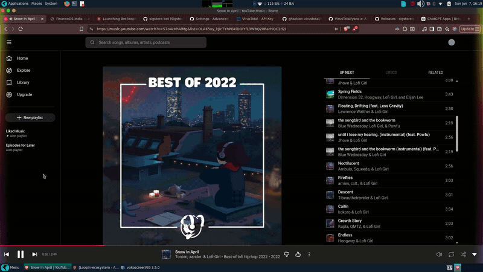

<div align="center">

# 🌈 Loopin Ambience Mode

**Real-time audio-reactive ambient lighting for your screen edges.**

[](https://github.com/bkmaxbaibhav/loopin-ambience-mode/actions/workflows/build.yml)
[](https://github.com/bkmaxbaibhav/loopin-ambience-mode/actions/workflows/release.yml)
[](LICENSE)
[](https://github.com/bkmaxbaibhav/loopin-ambience-mode/releases/latest)

A cross-platform desktop application that renders a beautiful ambient glow along your screen borders, reacting in real-time to system audio output. Inspired by Android edge lighting — but for your entire desktop.



*Real-time audio visualization with dynamic shader effects*

</div>

---

## ✨ Features

- 🎵 **Real-time Audio Capture** — Captures system audio output via PulseAudio/PortAudio
- 🎨 **Multiple Visual Effects** — Beat Bloom, Neon Rails, and more shader-based effects
- 🔄 **Auto Mode** — Automatically switches effects based on beat energy and audio genre
- 🖥️ **Native Overlay** — Renders directly on screen edges using Wayland (wlr-layer-shell) or X11
- 🎛️ **System Tray Control** — Full control from the system tray with hotkey support
- ⚡ **GPU Accelerated** — OpenGL 3.3+ powered with GLSL shaders
- 🔧 **Hot-Reloadable Config** — Tweak settings in real-time without restarting
- 🚀 **Auto-Start** — Optional auto-start on login

---

## 📦 Installation

### Download Pre-built Packages

> **Pre-release — Linux only.** Windows support is coming in a future release.

Head to the [**Releases page**](https://github.com/bkmaxbaibhav/loopin-ambience-mode/releases/latest) and download the appropriate package for your distribution:

| Distribution | Package | Install Command |
| :--- | :--- | :--- |
| Ubuntu / Debian | `.deb` | `sudo dpkg -i loopin-ambience-mode-*.deb` |
| Fedora / RHEL | `.rpm` | `sudo rpm -ivh loopin-ambience-mode-*.rpm` |

> [!TIP]
> Each release includes `.sigstore.json` signature bundles alongside the packages.
> You can verify any download — see [Security & Verification](#-security--verification) below.

---

## 🛡️ Security & Verification

**Every release is built, signed, and scanned automatically in CI — no human touches the binaries.**

### Sigstore Keyless Signing

All release packages (`.deb` and `.rpm`) are cryptographically signed using [Sigstore](https://sigstore.dev/) keyless signing via GitHub Actions OIDC. This means:

- ✅ No private keys to leak — signing happens through GitHub's identity provider
- ✅ Signatures are publicly auditable on the [Rekor transparency log](https://rekor.sigstore.dev/)
- ✅ You can verify exactly which workflow, commit, and repo produced every binary

**Verify a download:**

```bash
cosign verify-blob <package-file> \
  --bundle <package-file>.sigstore.json \
  --certificate-identity-regexp "https://github.com/bkmaxbaibhav/loopin-ambience-mode" \
  --certificate-oidc-issuer https://token.actions.githubusercontent.com
```

### VirusTotal Integration

Every release is automatically uploaded to [VirusTotal](https://www.virustotal.com/) for malware scanning. Scan result links are appended directly to the release notes on the [Releases page](https://github.com/bkmaxbaibhav/loopin-ambience-mode/releases) — so you can always check the report before installing.

---

## 🔧 Building from Source

### Dependencies

| Library | Purpose |
| :--- | :--- |
| CMake 3.20+ | Build system |
| PortAudio | Audio capture |
| FFTW3 | FFT processing |
| OpenGL 3.3+ | GPU rendering |
| GLFW3 | Window management |
| GLAD | OpenGL loader |
| nlohmann/json | Configuration |
| Wayland / X11 | Display protocols |
| AppIndicator | System tray |

### Install Dependencies

<details>
<summary><strong>Ubuntu / Debian / Parrot OS</strong></summary>

```bash
sudo apt-get update
# Note: On newer releases, libayatana-appindicator3-dev is preferred
# to avoid packaging conflicts
sudo apt-get install -y \
  build-essential \
  cmake \
  pkg-config \
  portaudio19-dev \
  libfftw3-dev \
  libglfw3-dev \
  libgl1-mesa-dev \
  nlohmann-json3-dev \
  libayatana-appindicator3-dev \
  libwayland-dev \
  wayland-protocols \
  libwayland-bin \
  libx11-dev \
  libxfixes-dev \
  libpulse-dev
```

</details>

<details>
<summary><strong>Fedora / RHEL</strong></summary>

```bash
sudo dnf install -y \
  gcc-c++ \
  make \
  cmake \
  portaudio-devel \
  fftw-devel \
  glfw-devel \
  mesa-libGL-devel \
  nlohmann_json-devel \
  libX11-devel \
  libXfixes-devel \
  libappindicator-gtk3-devel \
  wayland-devel \
  wayland-protocols-devel \
  pulseaudio-libs-devel
```

</details>

<details>
<summary><strong>macOS</strong> (experimental)</summary>

```bash
brew install cmake portaudio fftw glfw3 nlohmann-json
```

</details>

<details>
<summary><strong>Windows</strong> (experimental)</summary>

Use vcpkg to install dependencies:

```bash
vcpkg install portaudio:x64-windows fftw3:x64-windows glfw3:x64-windows nlohmann-json:x64-windows
```

</details>

### Build

```bash
mkdir build && cd build
cmake .. -DCMAKE_BUILD_TYPE=Release -DCMAKE_INSTALL_PREFIX=/usr
make -j$(nproc)
```

### Package (optional)

```bash
cd build
cpack -G DEB   # generates .deb
cpack -G RPM   # generates .rpm
```

---

## 🗺️ Roadmap

| Session | Status | Description |
| :--- | :---: | :--- |
| Session 1 | ✅ | Project Scaffold + CMakeLists.txt |
| Session 2 | ✅ | Audio Capture (PortAudio) |
| Session 3 | ✅ | FFT Processing (FFTW3) |
| Session 4 | ✅ | Overlay Window & Shader Loading |
| Session 5 | ✅ | Audio-to-Visual Mapping |
| Session 6 | ✅ | Advanced Shader Effects & Color Modes |
| Session 7 | ✅ | Linux Platform, System Tray & Config |
| Session 8 | 🔲 | Windows Platform Implementation |
| Session 9 | 🔲 | Global Hotkeys & System Tray (Windows) |
| Session 10 | 🔲 | Optimization & Bug Fixes |
| Session 11 | 🔲 | Final Packaging & Distribution |

---

## 🤝 Contributing

**Welcome! We'd love your help.**

This project was originally **vibe-coded** — built fast with AI assistance to get the core experience working. The code quality reflects that: it works, it's fun, but it's not a textbook example of software engineering. **Please don't let that discourage you.** If anything, it means there are tons of opportunities to make things better.

Whether you want to:

- 🐛 Fix a bug
- ✨ Add a new visual effect or shader
- 🧹 Refactor and improve code quality
- 📖 Improve documentation
- 🧪 Add tests
- 🪟 Help with Windows/macOS support

…you are more than welcome. Contributions of all sizes are appreciated — from typo fixes to entire feature implementations.

Please see [CONTRIBUTING.md](CONTRIBUTING.md) for development guidelines and [CODE_OF_CONDUCT.md](CODE_OF_CONDUCT.md) for community standards.

---

## 📝 License

This project is licensed under the [MIT License](LICENSE).

---

<div align="center">

**Made with 🎧 and ✨ by [Baibhav Kumar](https://github.com/bkmaxbaibhav)**

*If you enjoy Loopin, consider giving it a ⭐ — it helps others discover the project!*

</div>
